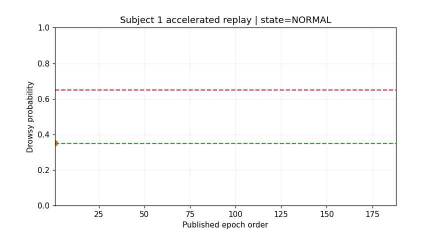
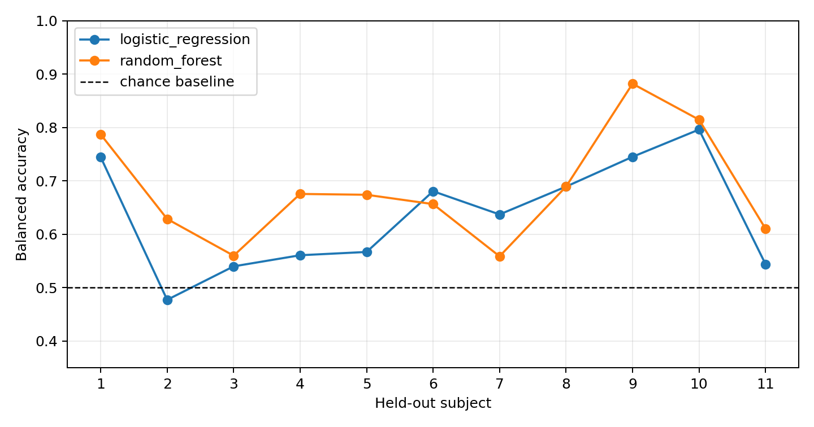
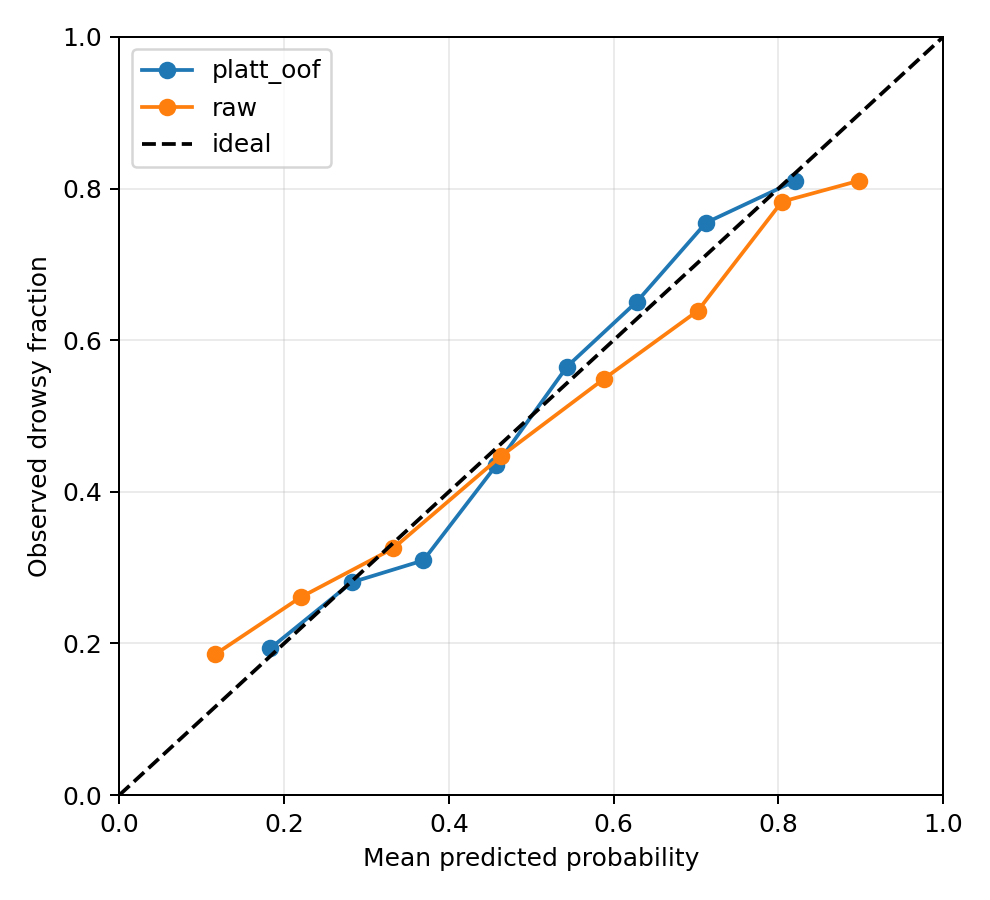
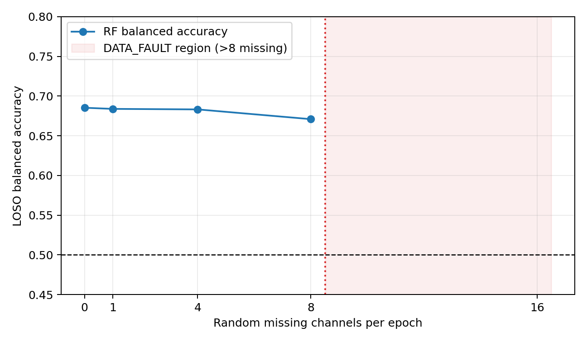

# EEG Fatigue Monitoring

Subject-held-out EEG classification with public-data baselines and explicit
uncertainty. [Quick start](#quick-start) · [results](#phase-2-results) ·
[public-data reproduction](docs/reproduction.md).

## Project timeline and provenance

| Milestone | Date | Scope |
|---|---|---|
| Research-program experience | Jun–Jul 2022 | In UMindFatigue, I contributed research, modeling support, equipment selection, data collection, and project presentation. |
| Public implementation and extension | Aug 2026 | I independently built this reproducible pipeline with synthetic and CC BY 4.0 public EEG data. |

The repository builds on my UMindFatigue experience while keeping the public implementation independent: it does not contain the original program code, participant data, documents, or other non-public material.

A reproducible research prototype for EEG preprocessing, spectral feature engineering,
leakage-resistant fatigue-state classification, and accelerated epoch replay. Phase 1 validates
the software on deterministic synthetic EEG. Phases 2-4 use a CC BY 4.0 public
driving-simulator dataset without redistributing it.

> **My contribution and validation boundary:** I implemented the preprocessing,
> feature engineering, leakage-resistant subject-grouped evaluation, baseline
> comparisons, public-dataset experiments, epoch replay, tests, and result
> artifacts in this public version. Metrics characterize this research pipeline,
> not clinical diagnosis, real-world driver monitoring, or safety-critical
> deployment.



## Why this project

EEG windows from the same participant are correlated. Randomly splitting windows can therefore let
person-specific information leak into both training and test data. This project treats the subject
as the evaluation unit and reports out-of-subject predictions using grouped cross-validation.

## Phase 1 pipeline

1. Generate eight-channel alert and fatigued EEG epochs with controlled spectral changes.
2. Reject large-amplitude artifacts and apply a 1–40 Hz IIR band-pass filter with MNE-Python.
3. Estimate Welch PSD and extract relative band powers, fatigue ratios, spatial dispersion,
   spectral entropy, and RMS amplitude.
4. Compare standardized logistic regression and a fixed random forest against a dummy baseline.
5. Save every fold metric and out-of-fold prediction plus four summary figures.

## Quick start

```bash
python3 -m venv .venv
source .venv/bin/activate
python -m pip install -e '.[dev]'
eeg-fatigue-study --config configs/default.yaml --output results
```

Full verification:

```bash
bash scripts/verify.sh
```

## Phase 2 public dataset

Download the checksum-pinned Figshare v3 artifact and run leave-one-subject-out evaluation:

```bash
eeg-fatigue-download
bash scripts/verify_figshare.sh
```

The dataset has 2,022 balanced alert/drowsy samples from 11 subjects. Labels are based on
subject-relative local and global reaction times in a sustained-attention driving simulation. See
[data/README.md](data/README.md) for DOI, license, checksum, provenance, and required citations.
The primary report uses every finite author-preprocessed sample and shows each held-out subject,
rather than hiding cross-person variability behind only an aggregate score.

### Phase 2 results

| Fixed model | Balanced accuracy | F1 | ROC AUC |
|---|---:|---:|---:|
| Prior-only dummy | 0.500 ± 0.000 | 0.000 ± 0.000 | 0.500 ± 0.000 |
| Logistic regression | 0.635 ± 0.099 | 0.619 ± 0.142 | 0.689 ± 0.109 |
| Random forest | **0.685 ± 0.099** | **0.685 ± 0.119** | **0.767 ± 0.103** |

Scores are the unweighted mean ± population standard deviation across 11 held-out subjects.
Random-forest balanced accuracy ranges from 0.559 to 0.882 across individuals, so the average is
not presented as uniform reliability. See [Phase 2 results](docs/phase2_results.md) for the full
interpretation and comparison boundary.



## Phase 3 robustness findings

- Random-forest balanced accuracy stays between 0.678 and 0.685 across no rejection and
  1,000/500/200 µV thresholds. The 200 µV condition removes more drowsy samples (103) than alert
  samples (52), however, so it is not adopted as the primary result.
- All ten features outperform band-power-only, ratio-only, and seven-feature spectral subsets for
  the random forest. Its subject-bootstrap 95% interval is 0.629–0.746, with an exact subject-level
  sign-flip `p=0.00098` against 0.5.
- Training-fold-only Platt calibration slightly improves mean Brier loss from 0.2102 to 0.2092,
  log loss from 0.6150 to 0.6082, and ECE from 0.1571 to 0.1445, but effects vary by subject.
- Nested subject-grouped tuning reduces logistic-regression balanced accuracy from 0.635 to 0.619.
  Hyperparameter search therefore does not replace the fixed primary baseline.

See [Phase 3 robustness](docs/phase3_robustness.md) for the full protocol and interpretation.



## Phase 4 accelerated epoch replay

```bash
bash scripts/verify_streaming.sh
```

Phase 4 wraps the out-of-subject random-forest predictions in a three-state monitor
(`NORMAL`, `DROWSY`, and `DATA_FAULT`) with configurable hysteresis. It also evaluates a fixed
missing-channel policy and measures single-epoch feature extraction plus inference on the Ubuntu
test host.

| Missing channels per epoch | Policy | RF balanced accuracy |
|---:|---|---:|
| 0 | no imputation | 0.6853 |
| 1 | median across available channels | 0.6839 |
| 4 | median across available channels | 0.6832 |
| 8 | median across available channels | 0.6709 |
| 16 | `DATA_FAULT`; no prediction | not evaluated |



Across 150 subject-1 epochs, feature extraction plus `predict_proba` took 26.25 ms at the median,
27.00 ms at p95, and 57.55 ms at the maximum. These are workstation measurements that exclude
EEG acquisition, transport, file I/O, and scheduler guarantees. The source MATLAB file provides
independent three-second samples, so the animation is accelerated epoch replay in published order,
not a continuous-time or real-time experiment. See [Phase 4 streaming](docs/phase4_streaming.md).

## Versioned evidence and generated outputs

The repository versions compact summaries, fold metrics, subject statistics, three representative
PNG figures, and the replay GIF under `results/`. Per-epoch features, predictions, replay events,
latency samples, and redundant figures are reproducible but ignored to keep the release focused.
The raw Figshare MATLAB file is always excluded.

## Roadmap

- **Phase 2:** complete — licensed public data, checksum verification, documented labeling protocol,
  and leave-one-subject-out baselines.
- **Phase 3:** complete — artifact sensitivity, feature ablations, subject-level uncertainty,
  cross-fitted probability calibration, and nested subject-grouped tuning.
- **Phase 4:** complete - accelerated epoch replay, alarm hysteresis, explicit data-fault handling,
  missing-channel sensitivity, workstation latency measurements, and an animated demo.
- **Public repository:** representative evidence is versioned; full per-epoch
  outputs can be reproduced and downloaded from the public-data workflow.

See [methodology](docs/methodology.md) and [limitations](docs/limitations.md) for details.

## License

MIT. External datasets are not covered by this license and must retain their original terms.
Software citation metadata is provided in [`CITATION.cff`](CITATION.cff); dataset attribution and
the three required source citations are recorded separately in [`data/README.md`](data/README.md).
